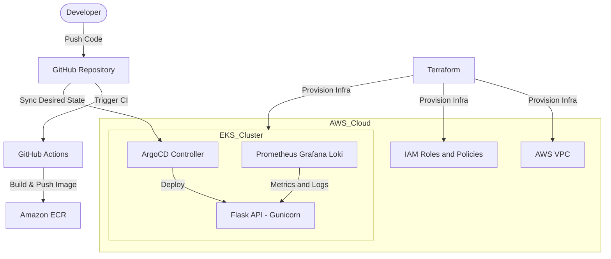

# 🚀 Cloud Native DevOps Platform

[](https://www.terraform.io/)
[](https://kubernetes.io/)
[](https://argoproj.github.io/cd/)
[](https://prometheus.io/)

A production-grade, end-to-end Cloud Native platform implementing modern DevOps and SRE practices. This project demonstrates automated infrastructure provisioning, GitOps-based continuous delivery, and full-stack observability for containerized workloads running on Kubernetes.


---

## 🏗️ Architecture Overview

The platform follows a **Hub-and-Spoke GitOps model**, with AWS as the underlying cloud infrastructure and Git serving as the single source of truth.



---

### 🔍 System Flow

1. Developer pushes code to GitHub
2. GitHub Actions builds Docker image and pushes to Amazon ECR
3. ArgoCD detects manifest changes from Git
4. Kubernetes cluster state is reconciled automatically
5. Application is deployed and exposed
6. Prometheus & Grafana continuously monitor system health

---

## 🛠️ Tech Stack

| Category                    | Tools                               |
| :-------------------------- | :---------------------------------- |
| **Cloud Provider**          | AWS (EKS, VPC, IAM, ECR)            |
| **Infrastructure as Code**  | Terraform                           |
| **Container Orchestration** | Kubernetes                          |
| **CI/CD & GitOps**          | GitHub Actions, ArgoCD              |
| **Application Layer**       | Python (Flask), Gunicorn, Docker    |
| **Observability**           | Prometheus, Grafana, Loki, Promtail |
| **Testing & Performance**   | Pytest, k6                          |

---

## ✨ Key Features

### 🔐 Infrastructure as Code (IaC)

Terraform modules in `/infrastructure` provision a fully isolated and production-ready AWS environment.

* **High Availability Architecture**

  * Multi-AZ VPC with public and private subnets
  * NAT Gateways for secure outbound connectivity

* **Managed Kubernetes**

  * Amazon EKS cluster with optimized node groups
  * Secure communication via IAM roles and security groups

---

### 🔄 GitOps Continuous Delivery

The `/argocd` directory acts as the **single source of truth** for cluster state.

* **Declarative Deployments**

  * All Kubernetes manifests version-controlled in Git

* **Automated Sync**

  * ArgoCD continuously reconciles desired vs actual state

* **Self-Healing System**

  * Manual drift is automatically corrected

---

### 📈 Observability & Reliability

* **Metrics Monitoring**

  * Prometheus collects system and application metrics
  * Grafana dashboards provide real-time visualization

* **Centralized Logging**

  * Loki + Promtail pipeline for log aggregation and querying

* **Resilience Engineering**

  * Kubernetes self-healing (pod restarts, rescheduling)
  * Horizontal Pod Autoscaler (HPA) for dynamic scaling

---

### ⚡ Performance & Load Testing

* k6 scripts simulate real-world traffic patterns
* Validates system behavior under stress conditions
* Helps identify bottlenecks and scaling limits

---

## 🚦 Getting Started

### 1. Local Development

```bash
cd application/

python -m venv venv

# Activate environment
# Windows:
venv\Scripts\activate

# Linux / Mac:
source venv/bin/activate

pip install -r requirements.txt

# Run tests
python -m pytest tests/

# Start application
python app/main.py
```

---

### 2. Infrastructure Provisioning

```bash
cd infrastructure/terraform

terraform init
terraform apply -auto-approve
```

This step provisions:

* VPC networking
* EKS cluster
* IAM roles and policies

---

### 3. Application Deployment

Ensure `kubectl` is configured for the EKS cluster:

```bash
kubectl apply -f argocd/application.yaml
```

ArgoCD will automatically:

* Pull manifests from Git
* Deploy application to the cluster
* Maintain desired state

---

## 📊 Maintenance & Scaling

* **Horizontal Pod Autoscaler (HPA)**

  * Dynamically scales pods based on CPU/memory utilization

* **Resource Management**

  * Requests and limits enforced to prevent resource starvation

* **Failure Handling**

  * Pods automatically restarted on failure
  * Nodes rescheduled in case of disruption

Explore `/reliability` for chaos testing and failure simulation scenarios.

---
