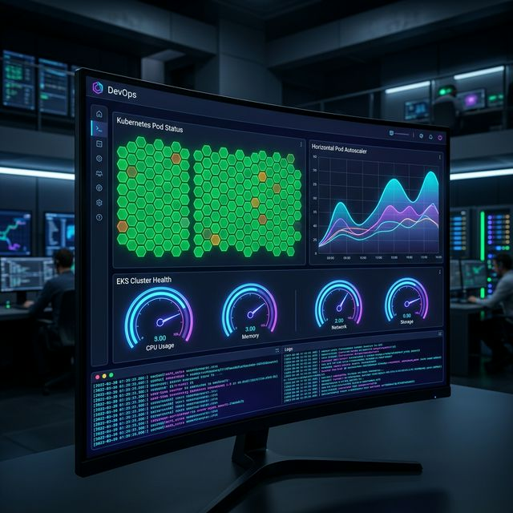
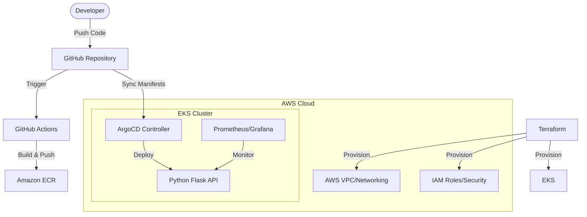

# 🚀 Cloud Native DevOps Platform

[](https://www.terraform.io/)
[](https://kubernetes.io/)
[](https://argoproj.github.io/cd/)
[](https://prometheus.io/)

A fully automated, production-ready Cloud Native platform showcasing modern DevOps practices. This repository implements a complete lifecycle for containerized applications, from automated infrastructure provisioning to GitOps-driven deployments and comprehensive observability.



---

## 🏗️ Architecture Overview

The platform follows a **Hub-and-Spoke** GitOps model, utilizing AWS as the primary cloud provider.



---

## 🛠️ Tech Stack

| Category | Tools |
| :--- | :--- |
| **Cloud Provider** | AWS (EKS, VPC, IAM, ECR) |
| **Infrastructure** | Terraform |
| **Orchestration** | Kubernetes |
| **CI/CD & GitOps** | GitHub Actions, ArgoCD |
| **Application** | Python (Flask), Gunicorn, Docker |
| **Monitoring** | Prometheus, Grafana, Loki, Promtail |
| **Testing** | Pytest, k6 (Load Testing) |

---

## ✨ Key Features

### 🔐 Infrastructure as Code (IaC)

Modular Terraform configurations located in `/infrastructure` manage the entire AWS environment.

- **High Availability**: Custom VPC with Multi-AZ NAT Gateways, ensuring zero downtime for outbound traffic from private subnets.
- **Compute**: Managed Amazon EKS cluster with optimized Node Groups and secured communication via cluster-associated security groups.

### 🔄 GitOps Continuous Delivery

The `/argocd` directory contains the source of truth for the cluster state.

- ArgoCD automatically synchronizes the cluster state with the Git repository.
- **Self-healing**: Any manual changes to the cluster are automatically reverted to the Git-defined state.

### 📈 Observability & Reliability

- **Full Stack Monitoring**: Integrated Prometheus and Grafana for metrics visualization.
- **Fault Tolerance**: Horizontal Pod Autoscaler (HPA) and automated pod self-healing.
- **Load Testing**: k6 scripts in `/testing` to validate performance under stress.

---

## 🚦 Getting Started

### 1. Local Development

```bash
cd application/
python -m venv venv
# Activate: venv\Scripts\activate (Windows) or source venv/bin/activate (Linux/Mac)
pip install -r requirements.txt
python -m pytest tests/
python app/main.py
```

### 2. Infrastructure Provisioning

```bash
cd infrastructure/terraform
terraform init
terraform apply -auto-approve
```

### 3. Application Deployment

Ensure your `kubectl` context is set to the new cluster:

```bash
kubectl apply -f argocd/application.yaml
```

---

## 📊 Maintenance & Scaling

The application is configured to handle traffic spikes via **Horizontal Pod Autoscaling (HPA)**. Resource limits are strictly enforced to ensure cluster stability. Explore the `/reliability` directory for detailed failure simulation scenarios.

---

